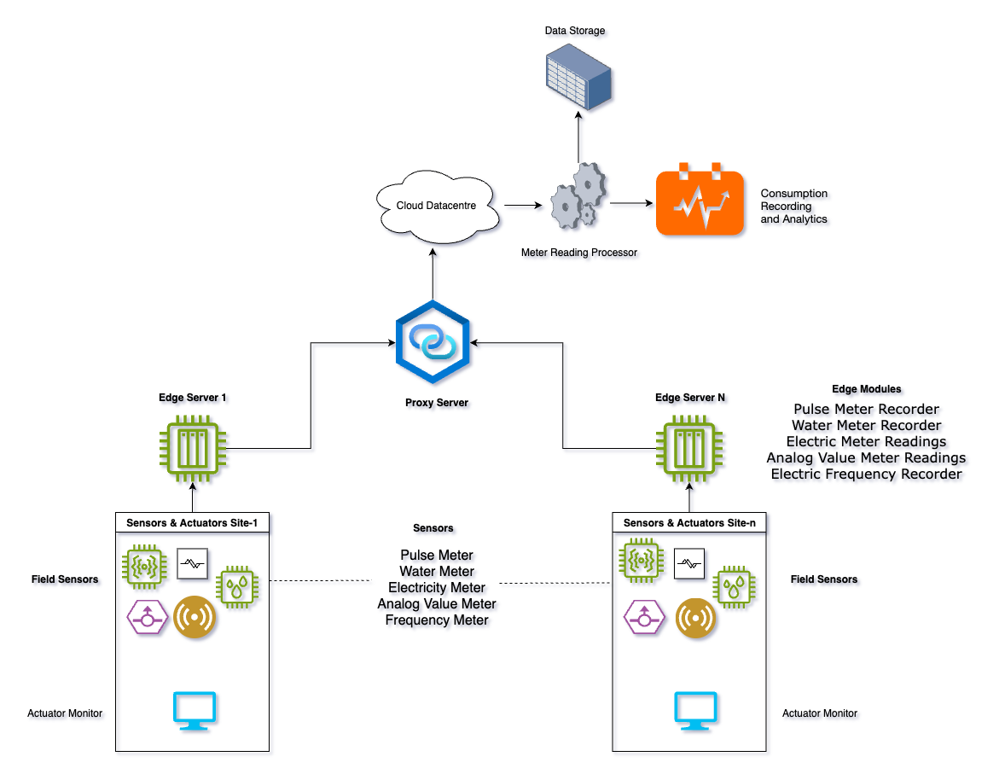

# Advanced Metering Infrastructure (AMI) Simulation

A fog computing simulation for Advanced Metering Infrastructure using IFogSim2 framework.

## Project Overview

This project simulates an Advanced Metering Infrastructure (AMI) system in a fog computing environment. The simulation models data flow from various utility meters (electricity, water, pulse, frequency, analog value) through edge servers to a cloud datacenter, enabling real-time meter data collection, processing, and analytics.



## System Architecture

The system consists of:
- **Field Sensors**: Various meters (Pulse, Water, Electricity, Analog Value, Frequency)
- **Edge Servers**: Process sensor data at the edge
- **Proxy Server**: Intermediary between edge and cloud
- **Cloud Datacenter**: Centralized processing and analytics
- **Data Storage**: Long-term storage of meter readings
- **Analytics**: Consumption recording and monitoring

## Requirements

- Java Development Kit (JDK) 8 or higher
- IFogSim2 framework
- CloudSim framework
- Maven (for dependency management)

## Installation

1. Clone the IFogSim2 repository:
```bash
git clone https://github.com/Cloudslab/iFogSim2.git
```

2. Build the IFogSim2 project using Maven:
```bash
cd iFogSim2
mvn clean install
```

3. Copy the `AdvanceMeteringInfrastructure.java` file to the `org.fog.test.perfeval` package in the IFogSim2 project.

## Configuration

The simulation is pre-configured with the following parameters, which can be modified in the source code:

- `numOfSites`: Number of metering sites (default: 30)
- `numOfPulseMeterPerField`: Pulse meters per field (default: 8)
- `numOfElectricitySensors`: Electricity sensors per site (default: 10)
- `frequencySensorPerFields`: Frequency sensors per field (default: 4)
- `analogValueMeterPerField`: Analog value meters per field (default: 6)
- `CLOUD`: Toggle between edge and cloud deployment (default: false)

## Running the Simulation

1. Ensure you have built the IFogSim2 project as described in the installation steps.

2. Run the simulation using one of the following methods:

   **From IDE (Eclipse/IntelliJ):**
   - Open the IFogSim2 project in your IDE
   - Navigate to `org.fog.test.perfeval.AdvanceMeteringInfrastructure`
   - Run as Java application

   **From Command Line:**
   ```bash
   cd iFogSim2
   java -cp target/classes:target/dependency/* org.fog.test.perfeval.AdvanceMeteringInfrastructure
   ```

## Understanding the Simulation

The simulation creates the following components:

1. **Fog Devices**:
   - Cloud datacenter
   - Proxy server
   - Edge servers for each site
   - Dedicated fog devices for each type of meter

2. **Sensors**:
   - Pulse meters with deterministic transmission intervals
   - Water meters for water consumption monitoring
   - Electricity sensors for usage monitoring
   - Frequency sensors for electric frequency monitoring
   - Analog value meters for analog measurements

3. **Application Modules**:
   - `analog-value-usage`: Processes analog meter data
   - `electric-frequency-sensing`: Processes frequency meter data
   - `water-sensing`: Processes water meter data
   - `electricity-usage`: Processes electricity usage data
   - `pulse-monitoring`: Monitors pulse meters
   - `smart-meter-analytics`: Performs analytics on collected data

4. **Data Flow**:
   - Sensors generate data that flows upward to their respective modules
   - Processed data is sent to actuators for monitoring
   - Analytics are performed at the cloud level

## Deployment Modes

The simulation supports two deployment modes:

1. **Edge Deployment** (default, `CLOUD=false`):
   - Processing modules are deployed on edge devices
   - Reduces latency and bandwidth usage

2. **Cloud Deployment** (`CLOUD=true`):
   - All processing modules are deployed in the cloud
   - Centralized processing but higher latency

To change deployment mode, modify the `CLOUD` variable in the source code.

## Output

The simulation will output performance metrics including:
- Module execution latency
- Network usage
- Energy consumption
- Application loop delays
